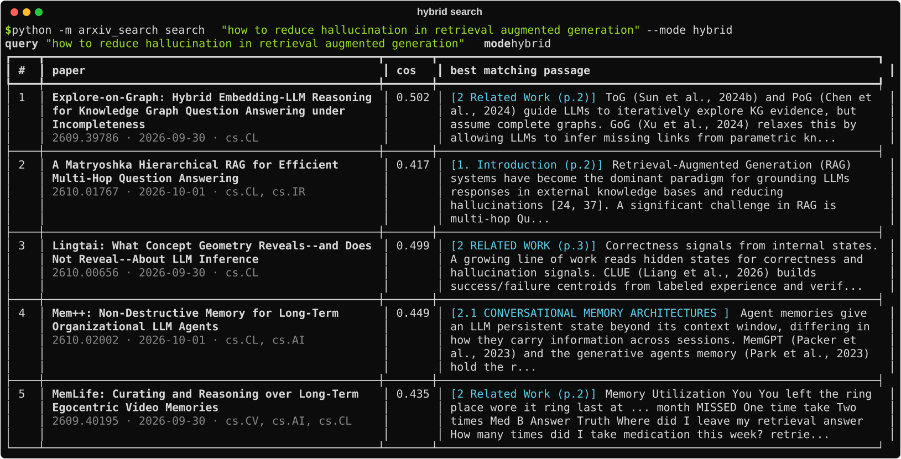
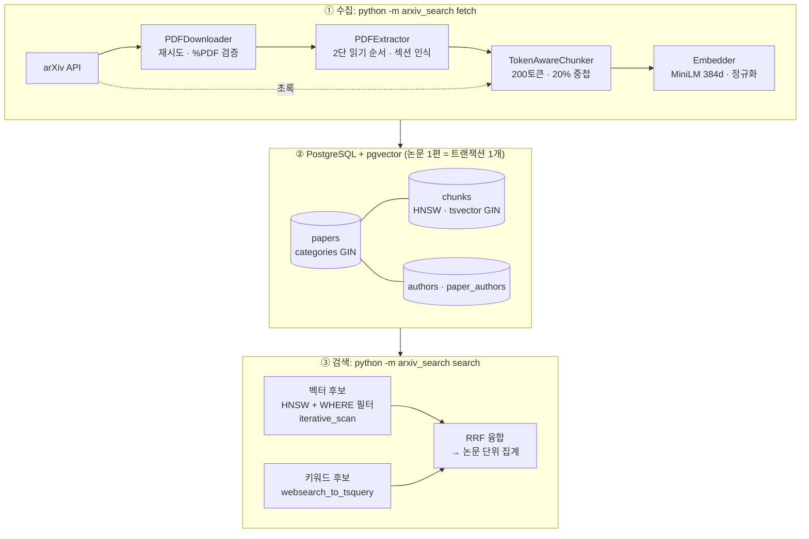
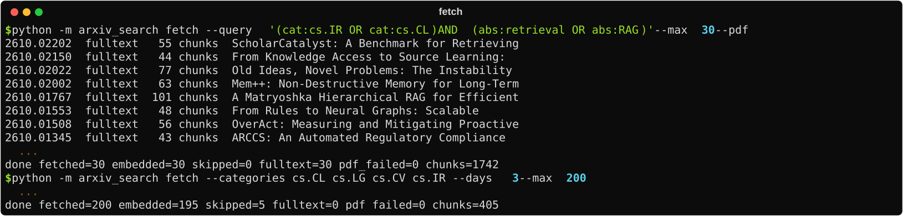
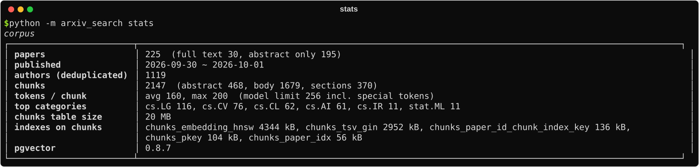
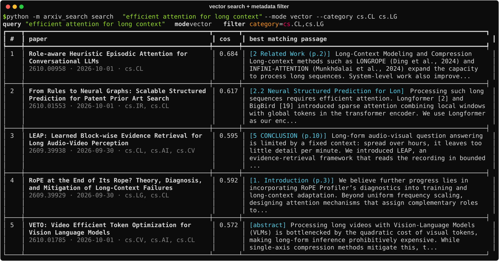
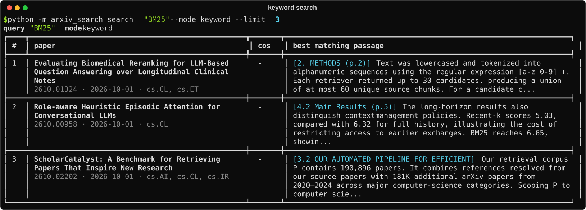
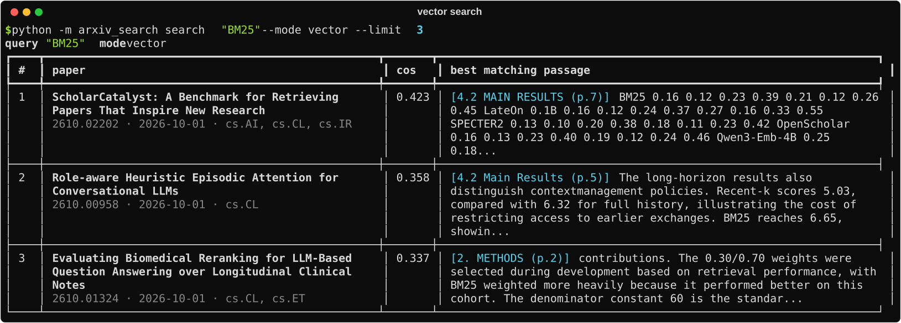
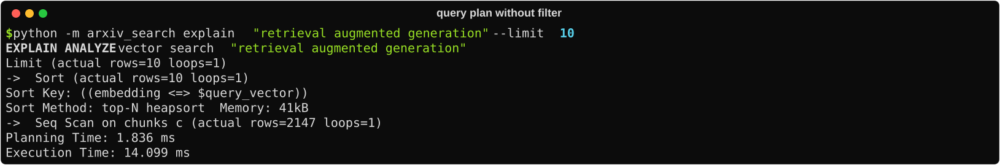
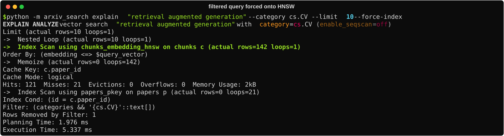
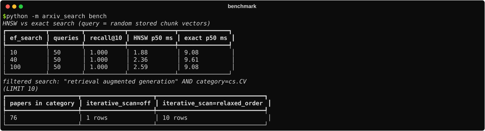

# pgvector-arxiv-search

PostgreSQL + pgvector 위에 만든 arXiv 논문 의미 검색 시스템입니다. 논문 메타데이터와 PDF 본문을 섹션 단위로 청킹해 임베딩하고, **벡터 유사도 · 전문 검색 · 메타데이터 필터를 SQL 한 번에** 처리합니다.

『벡터 데이터베이스』(니틴 보르완카르, 한빛미디어) 5장의 아키텍처를 출발점으로 삼았습니다. 책이 클래스·메서드 골격으로 남긴 부분을 직접 구현했고, 구현 중 확인한 문제(모델 입력 한도를 넘는 청크 크기, 필터 결합 시 결과 부족, 하이브리드 점수 스케일 불일치 등)를 설계로 해결했습니다. 결정 과정은 [docs/DESIGN.md](docs/DESIGN.md)에 있습니다.



## 핵심 수치 (로컬 실측, 2026-10-03)

| 항목 | 값 |
|---|---|
| 코퍼스 | 논문 225편 (본문 색인 30편, 초록만 195편), 저자 1,119명 |
| 청크 | 2,147개, 평균 160 토큰, **최대 200 토큰** (모델 한도 256 이내 보장) |
| HNSW vs 정확 검색 | recall@10 **1.000**, 지연 p50 **1.9ms vs 9.1ms** (쿼리 50개) |
| 드문 카테고리 필터 + LIMIT 10 | 반복 스캔 끄면 **1건**, 켜면 **10건** |
| PDF 처리 | 30편 중 실패 0건 |

환경: Intel macOS, CPU only, PostgreSQL 16 + pgvector 0.8.7, all-MiniLM-L6-v2 (384차원)

## 아키텍처



| 컴포넌트 | 파일 | 하는 일 |
|---|---|---|
| arXiv 클라이언트 | `arxiv_client.py` | 쿼리·카테고리+기간 검색, 버전 없는 ID로 정규화 |
| PDF 다운로더·추출기 | `pdf.py` | 재시도·검증·원자적 저장, 블록 좌표로 2단 읽기 순서 복원, References에서 중단 |
| 청커 | `chunker.py` | 임베딩 모델 토크나이저로 크기 측정, 문장·섹션 경계 보존, 한도 초과 입력 강제 분할 |
| 임베딩 | `embeddings.py` | 프로세스당 모델 1개, 정규화 벡터 |
| 저장 | `db.py`, `pipeline.py` | 메타데이터·저자·청크를 논문 단위 트랜잭션으로 교체 |
| 검색 | `search.py` | vector / keyword / hybrid(RRF), 필터, 유사 논문(청크 벡터 평균) |
| 측정 | `bench.py` | recall·지연, 필터 결과 부족 재현 |

## 실행

```bash
cp .env.example .env            # PGPASSWORD 수정
docker compose up -d            # pgvector/pgvector:pg16, 첫 기동 때 db/schema.sql 적용

python3.11 -m venv .venv && source .venv/bin/activate
pip install -r requirements.txt && pip install -e .
```

```bash
# 본문까지 색인 (PDF 다운로드 · 추출 · 청킹)
python -m arxiv_search fetch --query "(cat:cs.IR OR cat:cs.CL) AND (abs:retrieval OR abs:RAG)" --max 30 --pdf

# 최근 3일 논문, 초록만
python -m arxiv_search fetch --categories cs.CL cs.LG cs.CV cs.IR --days 3 --max 200

python -m arxiv_search search "how to reduce hallucination in RAG" --mode hybrid
python -m arxiv_search search "efficient attention for long context" --mode vector --category cs.CL cs.LG --since 2026-09-01
python -m arxiv_search similar 2610.01767
python -m arxiv_search stats
python -m arxiv_search explain "retrieval augmented generation" --category cs.CV --force-index
python -m arxiv_search bench
pytest
```

## 결과

### 수집
PDF 30편을 내려받아 섹션 단위로 청킹했습니다. 실패한 PDF는 버리지 않고 초록만으로 색인하도록 했습니다(이번 실행에서는 0건).



### 코퍼스 통계
청크 최대 200토큰, 모델 한도(256, 특수 토큰 포함) 안에 있습니다. HNSW 인덱스 4.3MB, 전문 검색 GIN 인덱스 2.9MB입니다.



### 벡터 검색 + 메타데이터 필터
카테고리 필터가 벡터 검색과 같은 SQL의 `WHERE`에 들어갑니다. 결과에는 가장 잘 맞은 구절과 섹션, 쪽 번호가 함께 나옵니다.



### 키워드 vs 벡터
같은 "BM25" 질의에서 키워드 검색은 단어가 등장하는 본문 문장을, 벡터 검색은 BM25 수치가 나열된 결과 표를 1위로 올립니다. 하이브리드는 RRF로 두 순위를 합칩니다.

**키워드 검색** (`--mode keyword`): "BM25"라는 단어가 실제로 등장하는 본문 문장을 찾습니다.



**벡터 검색** (`--mode vector`): 단어 일치가 아니라 의미가 가까운 청크를 찾아, BM25 점수가 나열된 실험 결과 표를 1위로 올립니다.



### 실행 계획: 규모가 작으면 플래너는 HNSW를 쓰지 않는다
청크 2,147개에서는 필터가 없어도 플래너가 순차 스캔 + top-N 정렬을 고릅니다. 이 규모에서는 정확 검색이 더 싸다는 판단입니다.



HNSW 경로를 강제하면, 인덱스가 **142행**을 읽어 cs.CV 조건에 맞는 10건을 채웁니다. 기본 후보 수(`ef_search` = 100)보다 더 읽은 것이 반복 스캔(`hnsw.iterative_scan`)이 동작한 흔적입니다.



### 벤치마크
이 규모에서 HNSW는 `ef_search` = 10에서도 정확 검색과 같은 결과(recall@10 = 1.0)를 5배 빠르게 냅니다. 아래 표는 반복 스캔이 없으면 드문 필터에서 결과가 1건으로 줄어드는 것을 보여 줍니다.



## 설계 결정 요약

자세한 문제·대안·대가는 [docs/DESIGN.md](docs/DESIGN.md).

1. **청크 크기는 임베딩 모델의 토크나이저로 잰다.** all-MiniLM-L6-v2는 256토큰에서 입력을 조용히 자릅니다. 책이 권한 512~1,024토큰 청크는 뒤쪽 절반이 벡터에 반영되지 않습니다. 200토큰 + 20% 중첩으로 바꾸고, 설정이 한도를 넘으면 적재 전에 실패시킵니다. PDF에 섞인 base64 이미지 데이터처럼 공백 없는 거대 토큰도 문자 단위로 잘라 한도를 보장합니다(실제로 357토큰 청크가 생겨 발견한 버그).
2. **필터와 벡터 검색을 한 SQL에 두고 `hnsw.iterative_scan`을 켠다.** pgvector에서도 HNSW 스캔 뒤에 필터가 걸리면 결과가 모자랍니다. sqlite-vss의 "10배 초과 조회" 대신 pgvector 0.8의 반복 스캔으로 해결하고, `SET LOCAL`로 트랜잭션 안에만 적용합니다.
3. **하이브리드 점수는 RRF.** 코사인 거리와 `ts_rank_cd`는 스케일이 달라 가중합이 의미를 잃습니다. 순위만 쓰는 RRF로 합칩니다.
4. **저자 UPSERT는 `normalized_name` 기준 + `RETURNING`.** 책 코드의 `ON CONFLICT (name)`은 스키마의 UNIQUE 제약과 맞지 않아 오류가 납니다. 충돌 시에도 id를 돌려받도록 `DO UPDATE`를 쓰고 저자 순서를 보존합니다.
5. **논문 1편 = 트랜잭션 1개, 임베딩은 트랜잭션 밖.** 모델 호출이 잠금을 잡지 않고, 한 논문의 실패가 다른 논문을 롤백하지 않습니다.
6. **필터가 없으면 조인을 뺀다.** 단일 테이블 `ORDER BY distance LIMIT k`가 인덱스로 바로 답할 수 있는 모양입니다.

## 한계와 다음 단계

- **PDF 품질**: 수식은 텍스트로 깨지고, 표·그림 안의 글자는 섞입니다(하이브리드 결과 5위가 그림 안 텍스트를 잡은 예). 학술 PDF 전용 파서(GROBID)가 다음 단계입니다
- **평가셋 부재**: recall은 "HNSW가 정확 검색을 얼마나 재현하는가"만 측정합니다. "검색 결과가 질문에 맞는가"를 재려면 질의·정답 쌍(qrels)이 필요합니다
- **규모**: 청크 수천 개에서는 플래너가 순차 스캔을 고릅니다. 수십만 청크 이상에서 HNSW 매개변수(`m`, `ef_construction`, `ef_search`)와 반복 스캔 비용을 다시 측정해야 합니다
- **모델**: 영어 전용 384차원 모델입니다. 다국어나 더 긴 입력이 필요하면 스키마의 `vector(384)`와 청크 크기를 함께 바꿔야 합니다

## 구조

```
.
├── db/schema.sql              # 테이블 · HNSW / GIN 인덱스 · 트리거
├── docker-compose.yml         # pgvector/pgvector:pg16
├── src/arxiv_search/
│   ├── arxiv_client.py
│   ├── pdf.py
│   ├── chunker.py
│   ├── embeddings.py
│   ├── db.py
│   ├── pipeline.py
│   ├── search.py
│   ├── bench.py
│   └── cli.py
├── scripts/capture.py         # README 이미지를 실제 실행 결과로 생성
├── tests/                     # 청커 · 필터 SQL · RRF · PDF 읽기 순서
└── docs/
    ├── DESIGN.md
    └── images/
```

## 참고

- 니틴 보르완카르, 『벡터 데이터베이스』, 정영균 옮김, 한빛미디어
- [pgvector](https://github.com/pgvector/pgvector): HNSW, iterative index scans
- Cormack et al., "Reciprocal Rank Fusion outperforms Condorcet and individual Rank Learning Methods", SIGIR 2009
